# Evidence-Bounded Cross-Vehicle View Transfer with Fail-Closed Abstention

Re-rendering a calibrated passenger-car recording into the geometry of a
seven-camera L4 delivery-vehicle rig, under the constraint that **no image of the
target rig exists** against which the result could be scored.

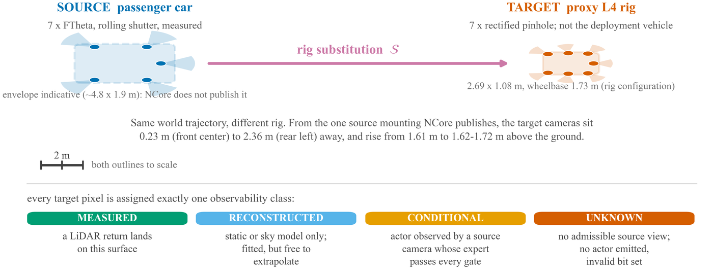

*Source and target differ in camera centres, mounting height, field of view, lens
model and shutter model simultaneously. Every target pixel is assigned exactly one
of four observability classes, and the renderer is required to say which.*

| | |
|---|---|
| **Delivery** | 7 cameras × 299 frames = **2,093** frames, 1920×1080 at 30 FPS, 9.97 s |
| **Static geometry** | surface-aligned 2DGS, LiDAR-supervised, **1.07 m** pooled depth MAE over 6.07 M held-out road pixels |
| **Actor layer** | 6 rigid experts over 42 tracks; **25.2%** of camera-frames carry an emitted actor |
| **Refusal** | **1,020** camera-frames (48.7%) had a temporally valid candidate and every gate refused it |
| **Compositing safety** | outside-actor RGB MAE ≤ **2.9 × 10⁻⁶** on all seven cameras |
| **Scope of the guarantee** | actor layer only — static + sky carry 97.3% of delivered pixels and may extrapolate |

This repository holds the renderer, the rig configuration, the evaluation
evidence, and the build system for the manuscript. It deliberately does **not**
hold the source dataset, the trained models, or the full rendered output — see
[What is not here](#what-is-not-here-and-why).

---

## What the method does

A passenger car and a delivery vehicle differ in camera centres, mounting height,
field of view, lens model and shutter model — all at once. That makes this
*rig substitution*, not novel-view synthesis, and it removes the held-out
reference image that view synthesis is normally scored against.

The approach is to render only what the source recording supports, and to
refuse rather than extrapolate.

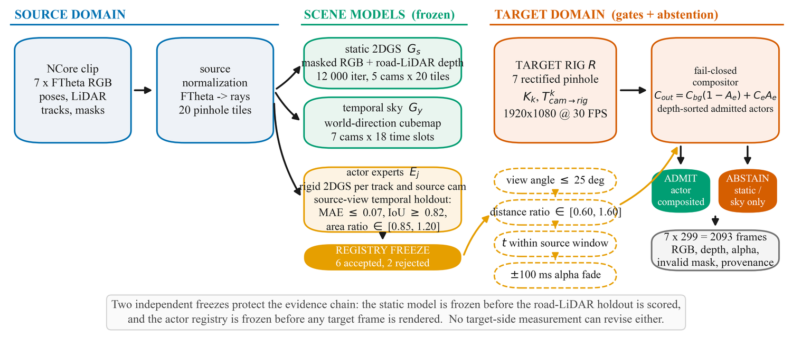

Source and target meet only in the NCore world frame. A source pixel is un-projected through the measured FTheta polynomial, rolling-shutter-corrected to its own row time, carried into world coordinates, and re-projected through the target rectified pinhole:

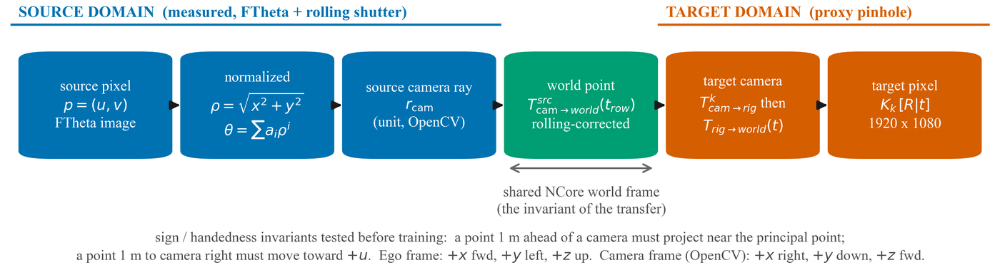

- **Static geometry** — surface-aligned 2D Gaussian splatting, supervised by
  road LiDAR, rendered directly into the target camera.
- **Sky** — a world-direction temporal cubemap, queried only where static alpha
  is incomplete.
- **Dynamic actors** — a frozen registry of rigid actor experts. An expert is
  admitted only if it reproduces its own source camera on a withheld holdout,
  *and* the target-side view-angle, distance-ratio and temporal gates all pass.
  Otherwise the renderer emits nothing and records which gate refused it.

**The fail-closed guarantee covers the actor layer only.** The static and sky
layers are unconditional reconstructions that may extrapolate, and they carry
97.3% of delivered pixels. The manuscript states this scope explicitly; so does
this README, because it is the single easiest thing to overread.

---

## The target rig

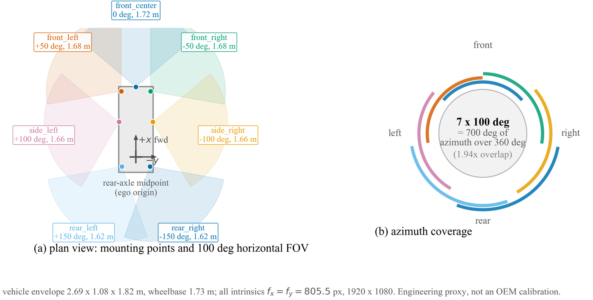

Seven rectified virtual pinholes on a 2.69 × 1.08 × 1.82 m proxy platform,
1.73 m wheelbase. Intrinsics are *fx = fy* = 805.5356 px, principal point
(959.5, 539.5), 100° horizontal / 67.673° vertical field of view. Full
configuration: [`configs/7fd4_neolix_x3_size_7v.json`](configs/7fd4_neolix_x3_size_7v.json).

| Camera | x (m) | y (m) | z (m) | yaw (deg) | pitch (deg) | H-FOV (deg) |
|---|---:|---:|---:|---:|---:|---:|
| front centre | +2.20 | +0.00 | 1.72 | +0 | −4 | 100 |
| front left | +2.06 | +0.46 | 1.68 | +50 | −6 | 100 |
| front right | +2.06 | −0.46 | 1.68 | −50 | −6 | 100 |
| side left | +1.10 | +0.53 | 1.66 | +100 | −8 | 100 |
| side right | +1.10 | −0.53 | 1.66 | −100 | −8 | 100 |
| rear left | −0.30 | +0.44 | 1.62 | +150 | −7 | 100 |
| rear right | −0.30 | −0.44 | 1.62 | −150 | −7 | 100 |

Camera extrinsics are engineering assumptions constrained to the vehicle
envelope, not an OEM calibration. The platform specification and its provenance
are in [`docs/target-platform-sensors.md`](docs/target-platform-sensors.md).

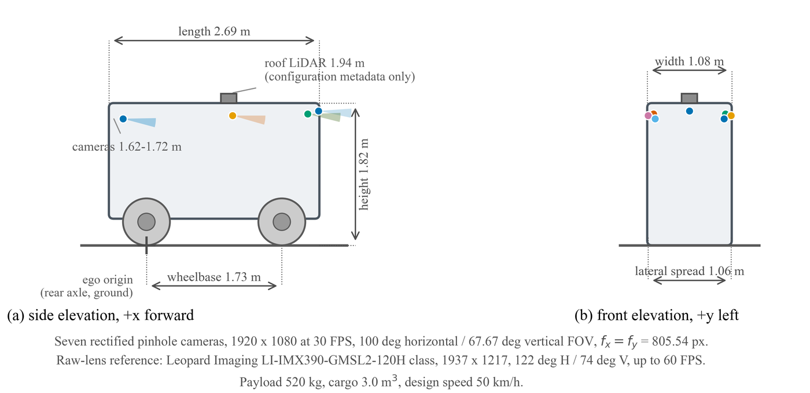

### How far each target camera moves

Measured against the single source mounting that NCore publishes:

| Target camera | Displacement (m) | Height change (m) |
|---|---:|---:|
| front centre | 0.23 | +0.11 |
| front right | 0.41 | +0.07 |
| front left | 0.53 | +0.07 |
| side right | 1.02 | +0.05 |
| side left | 1.09 | +0.05 |
| rear right | 2.34 | +0.01 |
| rear left | 2.36 | +0.01 |

Rear cameras move more than ten times as far as the front centre, which is why
per-camera results below are not interchangeable.

---

## Results

Every number here is read from [`evidence/`](evidence) by
`paper_build/paper_data.py`, and `paper_build/verify_claims.py` re-derives all of
them from the built manuscript on every run.

### Static geometry — the only layer with an independent reference

Road LiDAR returns are held out and compared against the *same* static 2DGS model
the delivery uses. This validates the geometry in the **source** domain; it is not
target-view ground truth.

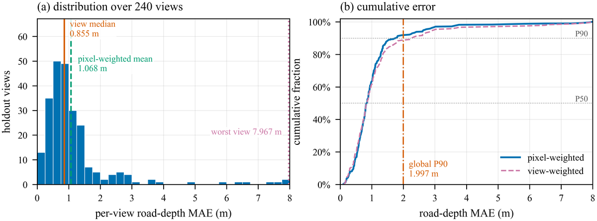

| Source camera | Held-out views | Road pixels | Depth MAE (m) | Median (m) |
|---|---:|---:|---:|---:|
| `camera_cross_left_120fov` | 72 | 1,619,536 | 0.892 | 0.208 |
| `camera_front_wide_120fov` | 72 | 2,121,962 | 0.968 | 0.256 |
| `camera_rear_left_70fov` | 12 | 388,605 | 1.120 | 0.420 |
| `camera_rear_right_70fov` | 12 | 393,285 | 1.257 | 0.321 |
| `camera_cross_right_120fov` | 72 | 1,543,841 | 1.328 | 0.278 |
| **pooled** | **240** | **6,067,229** | **1.068** | 0.253 |

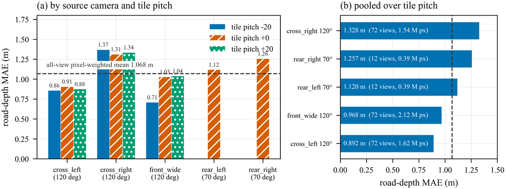

The gap between a 1.07 m mean and a 0.25 m median is the whole story: central
road depth is accurate, and a long tail at range carries the mean. The p90 is
2.00 m.

### Actor registry — what the gates admitted and refused

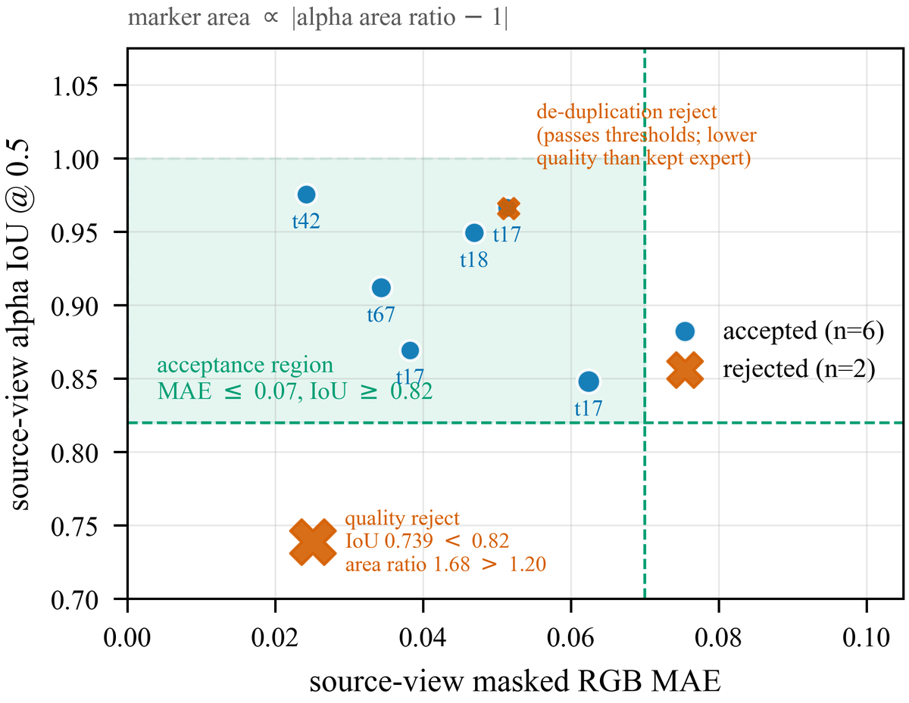

Six experts over 42 candidate tracks survived the source-side holdout; two were
rejected. Admission to a given target camera then requires the view-angle,
distance-ratio and temporal gates to pass on that camera, which is why an
accepted expert still appears on some cameras and not others.

### Per-camera delivery ledger

| Camera | Actor-active frames | Zero-actor rate | Mean actor area | Adjacent alpha IoU | Outside-actor RGB MAE |
|---|---:|---:|---:|---:|---:|
| front centre | 147 / 299 | 50.8% | 4.54% | 0.884 | 7.7 × 10⁻⁷ |
| front left | 62 / 299 | 79.3% | 1.84% | 0.796 | 2.3 × 10⁻⁷ |
| front right | 102 / 299 | 65.9% | 4.85% | 0.811 | 1.8 × 10⁻⁶ |
| side left | 37 / 299 | 87.6% | 1.32% | 0.631 | 2.0 × 10⁻⁷ |
| side right | 115 / 299 | 61.5% | 5.03% | 0.707 | 2.9 × 10⁻⁶ |
| rear left | 18 / 299 | 94.0% | 0.08% | 0.720 | 3.0 × 10⁻⁸ |
| rear right | 46 / 299 | 84.6% | 1.10% | 0.479 | 1.1 × 10⁻⁶ |

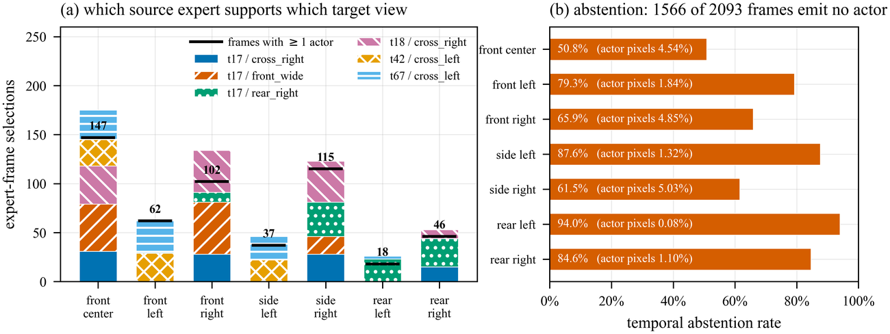

**Adjacent alpha IoU** is a temporal-consistency proxy, not an accuracy measure:
it says the actor mask moves smoothly between adjacent frames, and says nothing
about whether the actor is geometrically correct in a view nobody observed.
**Outside-actor RGB MAE** checks compositing safety — that writing an actor did
not disturb any pixel outside its own mask — and likewise is not photometric
ground truth.

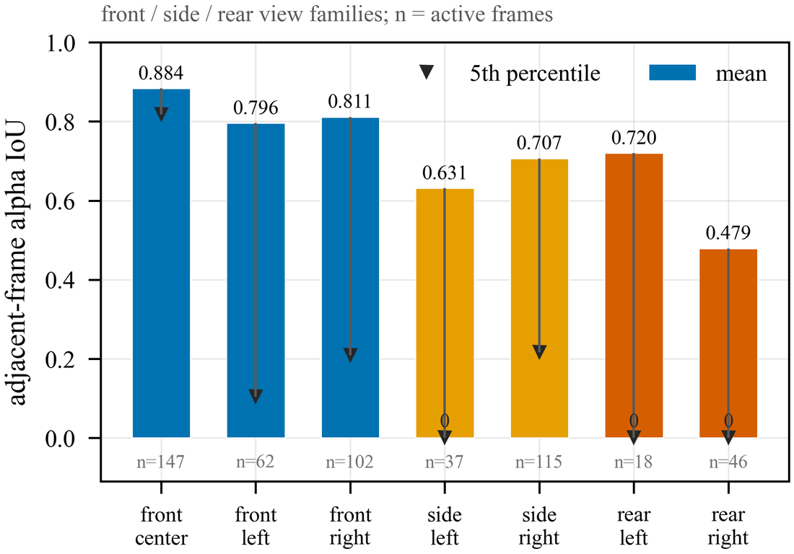
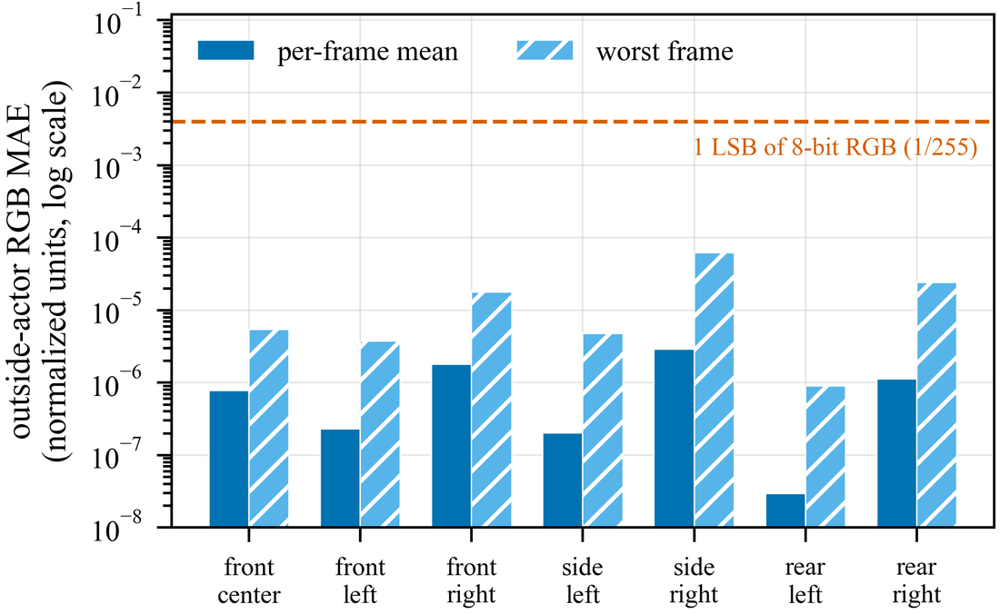

### Abstention, decomposed

74.8% of camera-frames contain no actor. Quoting that as a refusal rate would
overstate what the gates withheld, because it pools two different events:

| Event | Camera-frames | Share of delivery |
|---|---:|---:|
| No expert temporally valid (78 of 299 timestamps × 7 cameras) | 546 | 26.1% |
| Candidate valid, every gate refused it | 1,020 | 48.7% |
| **Pooled zero-actor** | **1,566** | **74.8%** |
| Actor emitted | 527 | 25.2% |

Only the 1,020 is a refusal. Neither figure is a risk measurement — both count
how much the renderer withheld, and neither says anything about the error of what
it emitted.

### Sensitivity to platform size

The delivered rig is a 2.69 m proxy. Scaling the envelope toward a real delivery
platform moves every camera further from the one source mounting, which is the
quantity the method is sensitive to:

| Envelope scale | Vehicle length (m) | Min displacement (m) | Max displacement (m) | Mean (m) |
|---:|---:|---:|---:|---:|
| 1.00× | 2.69 | 0.23 | 2.36 | 1.14 |
| 1.25× | 3.36 | 0.75 | 2.46 | 1.30 |
| 1.50× | 4.04 | 0.82 | 2.56 | 1.53 |
| 1.75× | 4.71 | 0.87 | 2.67 | 1.80 |
| 2.00× | 5.38 | 1.02 | 2.77 | 2.10 |

Mean displacement nearly doubles, 1.14 m → 2.10 m, at a 2× envelope.

### Delivered output

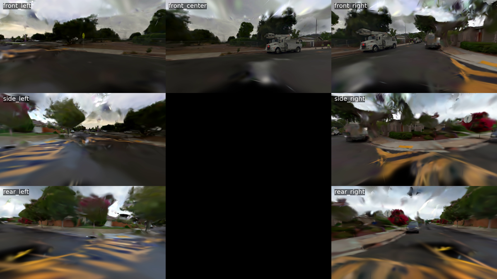

*One timestamp across all seven target cameras, downscaled to 1200 px wide — a
lower resolution than the 640×360 demonstration clips, and included on the same
terms. The blank centre tile is the mosaic layout, not a missing camera.*

Moving footage is in [`demo/`](demo): `l4_7v_mosaic_640x360_demo.mp4` and
`camera_comparison_640x360_demo.mp4`. The full-resolution output is withheld —
see below.

---

## Data

| File | Contents |
|---|---|
| [`evidence/quality_metrics.csv`](evidence/quality_metrics.csv) | Flat table of every headline metric with unit and interpretation |
| [`evidence/road_lidar_holdout_same_static_model.json`](evidence) | Per-view LiDAR-vs-2DGS depth holdout, 240 views |
| [`evidence/accepted_actor_registry.json`](evidence) | The 6 admitted experts, their validity windows and source-side scores |
| [`evidence/front_*.json`, `side_*.json`, `rear_*.json`](evidence) | Per-camera composite audit, 7 files |
| [`evidence/static_2dgs_1080p_manifest.json`](evidence) | Static-layer render manifest |
| [`evidence/actor_composite_1080p_manifest.json`](evidence) | Actor-layer composite manifest |
| [`evidence/checksums.sha256`](evidence/checksums.sha256) | SHA-256 over every file in `evidence/`; verify with `sha256sum -c evidence/checksums.sha256` |
| [`paper_build/figures/dataset_panels.json`](paper_build/figures/dataset_panels.json) | Panel counts backing the dataset figures (8 + 7 + 6 = 21) |

Each per-camera JSON carries its own `limitations` block naming what the metric
does **not** establish. Those blocks are quoted verbatim in the manuscript.

### Documentation

| Document | Contents |
|---|---|
| [`docs/technical-report.md`](docs/technical-report.md) | Full technical report |
| [`docs/measured-results.md`](docs/measured-results.md) | Measured-results report |
| [`docs/failure-cases-and-limits.md`](docs/failure-cases-and-limits.md) | Failure log and limits |
| [`docs/data-sources.md`](docs/data-sources.md) | Data-source notes |
| [`docs/data-compliance.md`](docs/data-compliance.md) | Data-compliance statement |
| [`docs/source-vehicle-sensors.md`](docs/source-vehicle-sensors.md) | Source-vehicle sensor notes |
| [`docs/target-platform-sensors.md`](docs/target-platform-sensors.md) | Target-platform sensor notes |

---

## Repository layout

| Path | Contents |
|---|---|
| `src/nurec_gs_renderer/` | Renderer, camera models, sky compositing, 2DGS data interfaces, actor registry and gates (146 modules) |
| `configs/` | Rig configuration and per-experiment configs. `7fd4_neolix_x3_size_7v.json` is the target rig |
| `evidence/` | Every measured quantity the manuscript reports, as JSON + CSV, with SHA-256 checksums |
| `paper_build/` | Deterministic manuscript build: content modules, figure generators, and the audit that checks the text against `evidence/` |
| `docs/` | Technical report, sensor and data-source notes, compliance statement, results report, failure log |
| `docs/figures/` | The figures reproduced in this README |
| `demo/` | Low-resolution demonstration videos (see licence note below) |
| `DEPLOY.md` | Reproduction entry point — environment, asset interfaces, re-render and verification |

---

## Install

Python 3.10+ with CUDA for the rendering path.

```bash
pip install -r requirements.txt
pip install -e .
```

The 2D Gaussian Splatting backend and its CUDA rasteriser are **not vendored
here**. Obtain them from their own repositories under their own licences; see
[`third_party.md`](third_party.md), which lists every external component, its
source, and its licence boundary.

## Deploy and reproduce

[`DEPLOY.md`](DEPLOY.md) is the authoritative entry point. In outline:

```bash
cp env.example env.local        # fill in dataset and output roots
./run_render_1080p_7v.sh        # re-render the 1080p seven-view delivery
```

Rendering requires NCore access (below) and a GPU. Everything downstream of the
render — the evidence JSONs, every number in this README, every number in the
manuscript, and every figure — rebuilds from this repository alone:

```bash
cd paper_build
python build_access_paper.py    # build the manuscript
python verify_claims.py         # deterministic checks against evidence/
python figures/make_figs_data.py       # result plots
python figures/make_figs_schematic.py  # schematic figures
```

`verify_claims.py` re-extracts the built text on every run and fails on any
mismatch between what the manuscript says and what `evidence/` contains. It is
the check to run after any edit.

---

## What is not here, and why

The source recording is the **NVIDIA PhysicalAI Autonomous Vehicles NCore**
dataset, used under the NVIDIA Autonomous Vehicle Dataset License Agreement.
Those terms govern the rendered output as much as the input: a redistribution
of the target-rig stream is a redistribution of a derivative work, not the
creation of an unencumbered one.

Accordingly this repository does **not** contain:

- source images, LiDAR, calibration, trajectories or scene labels;
- trained model weights or Gaussian scene assets;
- the full per-frame rendered PNG sequences;
- the full-resolution delivered videos or representative frames.

To reproduce the render you must obtain NCore access yourself from the
[dataset page](https://huggingface.co/datasets/nvidia/PhysicalAI-Autonomous-Vehicles-NCore)
and accept its licence.

### The demonstration material

`demo/` holds two 640×360 clips, downscaled from the delivered 1920×1080
output, and `docs/figures/fig12_mosaic_7v_lowres.png` is a single still at a
lower per-tile resolution than those clips. They are included to show coverage
and cross-camera synchronisation. They are **not** a dataset release: do not
redistribute them as one, do not mine them for licence plates, faces or
pedestrian identity, and do not present them as a recording from any commercial
vehicle. Every other figure in this README is generated from `evidence/` and
contains no dataset pixels.

The source clip is a public-road recording and contains identifiable third
parties. The renderer does not remove them — it withholds only what it cannot
support geometrically, which is a different criterion from privacy. Every frame
carries a provenance record naming its source timestamp, so an erasure request
against a source interval resolves to an exact set of derived frames.

---

## Licensing

The code and configuration in this repository are licensed under
[Apache-2.0](LICENSE).

That licence covers **this repository's own contents only**. It does not and
cannot relicense:

- the NCore dataset or anything derived from it, including `demo/` and
  `docs/figures/fig12_mosaic_7v_lowres.png`;
- the 2D Gaussian Splatting code and its submodules, which carry the
  Gaussian-Splatting License (Inria / MPII) restricting use to research and
  evaluation;
- any other third-party component in [`third_party.md`](third_party.md).

---

## Status and honest limits

Results come from **one 9.97 s clip** re-rendered into **one engineering proxy
rig**, with a registry of six rigid actors and no deformable objects. The
rendered rig is a 2.69 × 1.08 × 1.82 m proxy, not the larger deployment platform
the work is aimed at; the coverage figures characterise the proxy. No
head-to-head superiority claim is made, because no shared target-view benchmark
exists.

Every metric in the Results section above is measured in the **source** domain
or is a **consistency proxy**. None of them is target-view photometric ground
truth, because no target-rig reference image exists.

The decisive missing experiment is stated in the manuscript: hold out one
physical source camera entirely, render its real poses, and score against its
real images. That would convert the current coverage numbers into a genuine
risk–coverage trade-off. It has not been run.
